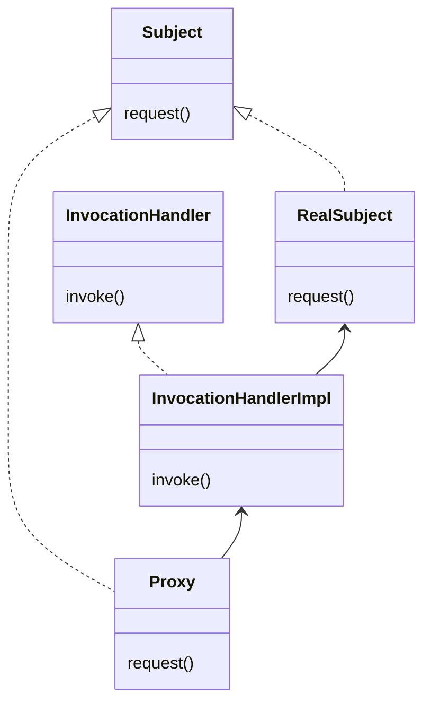

# Proxy Pattern

> Use the Proxy Pattern to create a representative object that controls access to another object, which may be remote,
> expensive to create, or in need of securing.
> The Proxy Pattern provides a surrogate or placeholder for another object to control access to it.

프록시 패턴의 사용은 원격에 있거나 생성 비용이 많이 들거나 보안이 필요한 객체에 대하여 액세스를 제어하는 표하는 대표 객체를 생성하는 것 입니다.
프록시 패턴은 다른 객체가 access를 제어할 수 있도록 대리자나 표시자를 제공합니다.

# Proxy Pattern vs Decorator Pattern

| Pattern   | Description |
|:----------|:------------|
| Decorator | 클래스에 행위를 추가 |
| Proxy     | 객제의 접근 제어   |

# Dynamic Proxy

InvocationHandler 를 이용하여 모든 메소드는 실행은 invoke()를 통과하게 된다.
InvocationHandler는 실제 객체의 메소드의 접근을 제어하게 된다.

