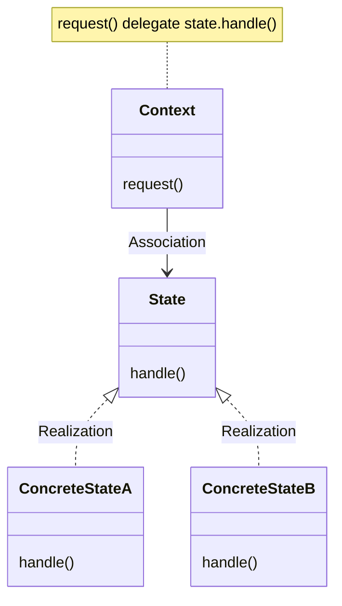

The State Pattern allows an object to alter its behavior when its internal state changes.
The object will appear to change its class.

State Pattern Class Diagram is exactly the same as the strategy patter class diagram.

State Pattern 에서는 캡화된 State Objects 집합을 가지고 있으면서 상태의 변화에 따라 대리하여 실행된다.
따라서 Client는 최소한의 정보만을 가지게 된다.

Strategy Pattern은 Client 가 Context에 부합하는 Strategy Objects를 runtime 시에 결정한다.

Strategy Pattern은 유연한 하위 클래스 대안을 구성한다.
State Pattern은 context내에 다양한 조건을 추가한다.

