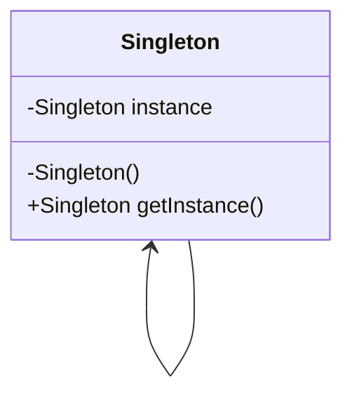

# Singleton Pattern

# Class Diagram

```mermaid
classDiagram
    Singleton <-- Singleton
    class Singleton {
        -Singleton instance
        -Singleton()
        +Singleton getInstance()
    }
```

# 장점

# 단점
