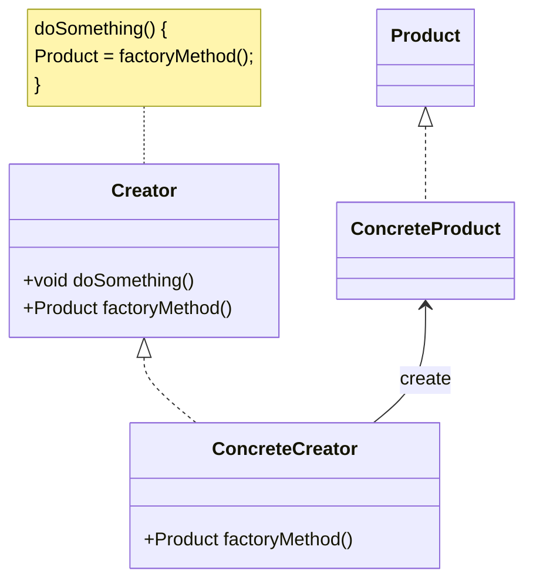

# Factory Method Pattern

구체적으로 어떤 인스턴스를 만들지는 서브 클래스가 정한다.
다양한 구현체(Product)가 있고, 그중에서 특정한 구현체를 만들 수 있는 다양한 팩토리(Creator)를 제공할 수 있다.

# Class Diagram

# 장점

- 확장에 열려 있고 변화에 닫혀 있는 객체 지향 원칙 open close principal 에 부합
- 인스턴스를 만드는 메소드를 건드리지 않고 다양한 인스턴스를 만들게 확장 가능하다.
- 기존 코드를 변경하지 않고 확장이 가능하다.

# 단점

- 복잡도 증가한다.

