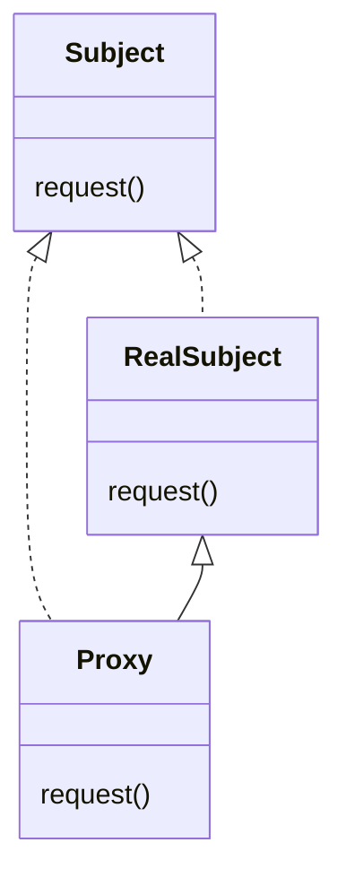
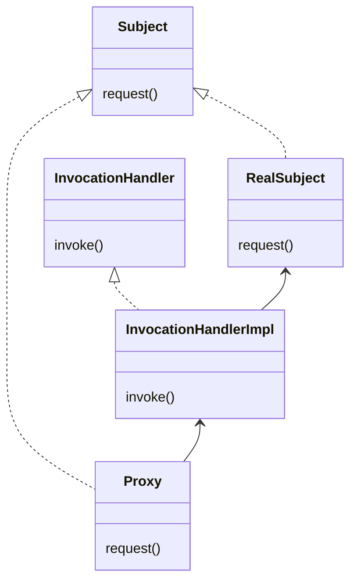

# proxy pattern

특정 객체를 실행하기 전에 proxy 객체를 먼저 진행 후 진행하는 패턴이다.
클라이언트는 언래 클래스를 직접 쓰지 않고 중간 대리인을 거쳐서 사용한다.
해당 객체에 대한 접근 제어 및 생성 시간 오래 걸릴 시 지연 로딩 처리, 캐싱 처리 등에 사용한다.

# Class Diagram

# 장점

- 기존 코드를 변경하지 않고 새로운 기능을 추가할 수 있다.
- 기존 코드가 해야 하는 일만 유지할 수 있다.
- 기능 추가 및 초기화 지연 등으로 다양하게 활용할 수 있다.

# 단점

- 코드 복잡도가 증가한다.
-

> Use the Proxy Pattern to create a representative object that controls access to another object, which may be remote,
> expensive to create, or in need of securing.
> The Proxy Pattern provides a surrogate or placeholder for another object to control access to it.

프록시 패턴의 사용은 원격에 있거나 생성 비용이 많이 들거나 보안이 필요한 객체에 대하여 액세스를 제어하는 표하는 대표 객체를 생성하는 것 입니다.
프록시 패턴은 다른 객체가 access를 제어할 수 있도록 대리자나 표시자를 제공합니다.

# Proxy Pattern vs Decorator Pattern

| Pattern   | Description |
|:----------|:------------|
| Decorator | 클래스에 행위를 추가 |
| Proxy     | 객제의 접근 제어   |

# Dynamic Proxy

InvocationHandler 를 이용하여 모든 메소드는 실행은 invoke()를 통과하게 된다.
InvocationHandler는 실제 객체의 메소드의 접근을 제어하게 된다.
newProxyInstance()는 interface 만을 허용한다.

# bullet points

- 프록시 패턴은 클라이언트의 액세스를 제어하기 위해 다른 개체에 대한 대표자를 제공한다.
- Remote Proxy는 클라이언트와 원격 개체 간의 상호 작용을 관리한다.
- 가상 프록시는 인스턴스화 비용이 많이 드는 개체에 대한 액세스를 제어한다.
- Protection Proxy는 호출자를 기준으로 개체 메서드에 대한 액세스를 제어한다. Proxy Pattern(프록시 패턴)의 다른 여러 변형에는 캐싱 프록시, 동기화 프록시, 방화벽 프록시, 복사-온-쓰기
  프록시 등이 있다.
- 프록시는 데코레이터와 구조적으로 비슷하지만 둘은 목적이 다르다. 데코레이터 패턴은 개체에 동작을 추가하는 반면 프록시는 액세스를 제어합니다.
- Java의 Proxy에 대한 기본 지원 기능은 동적 프록시 클래스를 요구에 따라 구축하고 선택한 처리자에게 모든 호출을 발송할 수 있다.
- 다른 Wrapper와 마찬가지로 프록시는 설계에서 클래스와 개체의 수를 증가시킨다.
