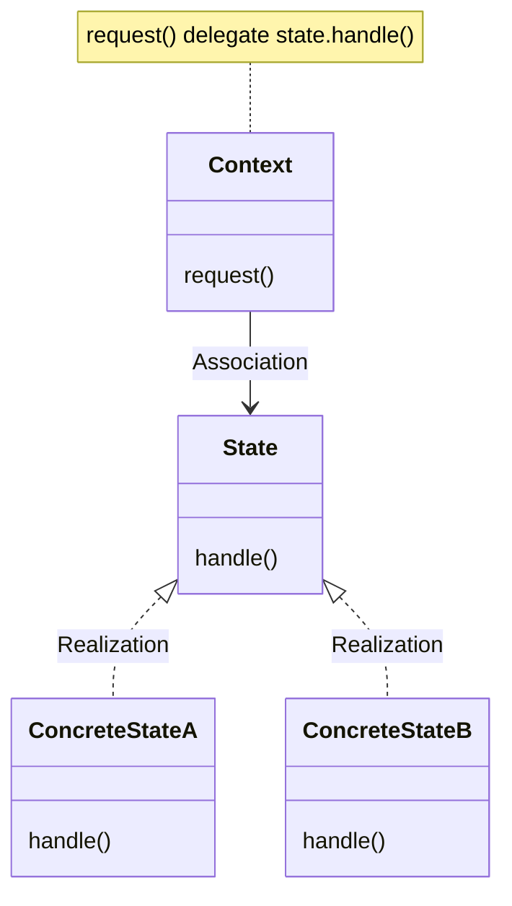

# State Pattern

객체 내부 상태 변경에 따라 객체의 행동이 달라지는 패턴

상태에 특화된 행동들을 분리해 낼 수 있으며, 새로운 행동을 추가하더라도 다른 행동에 영향을 주지 않는다.

# Class Diagram

# 장점

- class 분리로 인한 코드의 복잡도 감소
- 단위 테스트의 유리함

# 단점

- 과도한 오버 엔지니어링

The State Pattern allows an object to alter its behavior when its internal state changes.
The object will appear to change its class.

State Pattern Class Diagram is exactly the same as the strategy patter class diagram.

State Pattern 에서는 캡화된 State Objects 집합을 가지고 있으면서 상태의 변화에 따라 대리하여 실행된다.
따라서 Client는 최소한의 정보만을 가지게 된다.

Strategy Pattern은 Client 가 Context에 부합하는 Strategy Objects를 runtime 시에 결정한다.

Strategy Pattern은 유연한 하위 클래스 대안을 구성한다.
State Pattern은 context내에 다양한 조건을 추가한다.

| Pattern         | Description                            |
|:----------------|:---------------------------------------|
| State           | 캡슐화된 교체가능한 행동과 위임을 사용하여 어떤 행동을 사용할지 결정 |
| Strategy        | 하위 클래스에서 알고리즘의 스텝을 구현하여 결정             |
| Template Method | 상태 기반 행동을 캡슐화 하고 현재 상태에 따라 위임 행위       |

## BULLET POINTS

- The State Pattern allows an object to have many different behaviors that are based on its internal state.
- Unlike a procedural state machine, the State Pattern represents state as a full-blown class.
- The Context gets its behavior by delegating to the current state object it is composed with.
- By encapsulating each state into a class, we localize any changes that will need to be made.
- The State and Strategy Patterns have the same class diagram, but they differ in intent.
- Strategy Pattern typically configures Context classes with a behavior or algorithm. State Pattern allows a Context to
  change its behavior as the state of the Context changes.
- State transitions can be controlled by the State classes or by the Context classes. Using the State Pattern will
  typically result in a greater number of classes in your design.
- State classes may be shared among Context instances.
